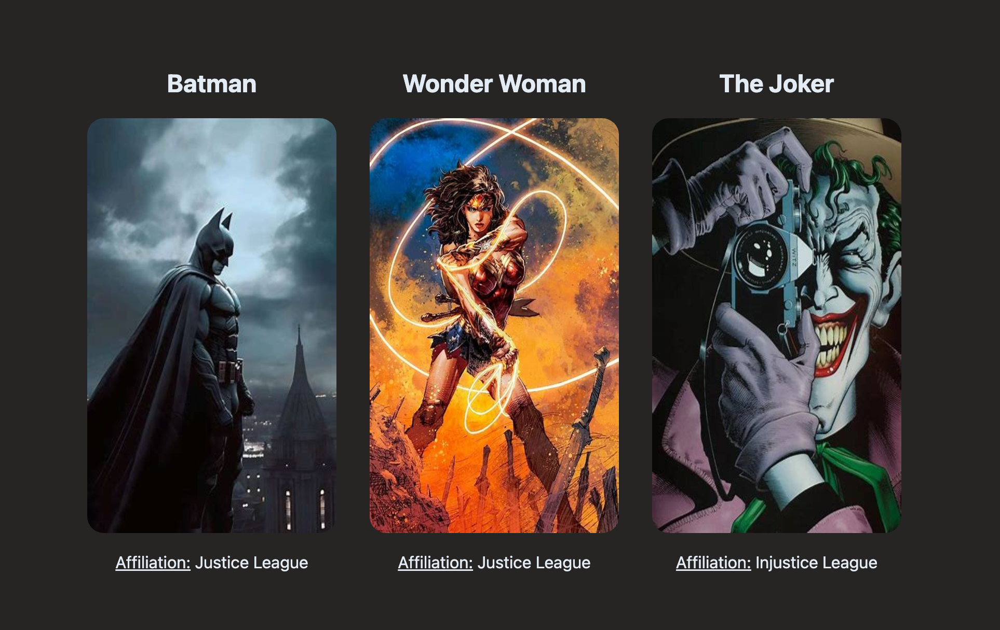

# 🚀 Reference App

Hi everyone! 👋 🌊


## 🎯 Purpose

The purpose of this app is to:

- Provide a reference implementation for a full-stack application.

---

## 🛠️ Tech Stack

This app is built using the following technologies:

### Backend (API) 🌐

- **Language**: Node.js
- **Framework**: NestJS
- **Database**: Static JSON
- **Authentication**: None

### Frontend (UI) 🎨

- **Framework**: Angular
- **Styling**: SCSS

---

## 🏃‍♂️ How to Run the App

### 1️⃣ Running the API (PORT 3000)

1. Navigate to the `api` directory:
   ```bash
   cd api
   ```
2. Install dependencies:
   ```bash
   npm install
   ```
3. Start the server:
   ```bash
   npm start
   ```
4. The API will be available at `http://localhost:3000/api`.

### 2️⃣ Running the UI (PORT 4200)

1. Navigate to the `ui` directory:
   ```bash
   cd ui
   ```
2. Install dependencies:
   ```bash
   npm install
   ```
3. Start the development server:
   ```bash
   npm start
   ```
4. The UI will be available at `http://localhost:4200`.

---

## 📚 Documentation

- **API**: Retrieves information an a DC comics character based on name.
- **UI**: Displays DC comics character info.

Happy coding! 💻✨
